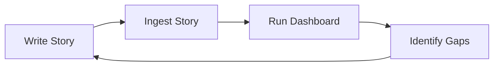

# 📊 Coverage Dashboard Guide

The **coverage dashboard** is a command-line tool that shows vocabulary usage statistics across your Latin story collection.

## What It Is

A Python script at [scripts/coverage_dashboard.py](../scripts/coverage_dashboard.py) that analyzes your database and displays:

1. **Overall Statistics** — total words, frequency tiers, overlaps
2. **Story Coverage** — percentage of vocabulary used in stories
3. **Most Used Words** — top 20 words by usage frequency
4. **Unused High-Frequency Words** — priority vocabulary not yet covered
5. **Vocabulary Clusters** — semantic groups with gaps
6. **Suggested Vocabulary** — recommended words for next story

## How to Run

```bash
python scripts/coverage_dashboard.py
```

The dashboard prints formatted output to your terminal.

## Example Output

```
======================================================================
📊 OVERALL VOCABULARY STATISTICS
======================================================================

Total words in database: 1405

Words by frequency tier:
  ff625          :  385
  core           :   82
  common         :  380
  supplemental   :  489

Words in both FF625 and DCC: 22

======================================================================
📖 STORY COVERAGE
======================================================================

Words used in stories: 45/1405 (3.2%)

FF625 coverage: 3/385 (0.8%)

DCC Core coverage by tier:
  core           :   3/ 82 (3.7%)
  common         :   3/380 (0.8%)
  supplemental   :   5/489 (1.0%)

======================================================================
⭐ TOP 20 MOST USED WORDS IN STORIES
======================================================================

Latin                English                          Uses         Tier
----------------------------------------------------------------------
canis                dog                                 5 supplemental
puer                 boy                                 5       common
sum                  be, exist                           3         core
currō                run                                 3 supplemental
...

======================================================================
🎯 TOP 30 UNUSED HIGH-FREQUENCY WORDS
======================================================================

Rank Latin                English                        Source
----------------------------------------------------------------------
3    quī                  who, which, what               dcc_core
4    que                  and (postpositive)             dcc_core
6    porcus               pig                            ff625
6    nōn                  no                             dcc_core
...

======================================================================
🔤 VOCABULARY CLUSTERS (Unused High-Frequency Words)
======================================================================

FF625 Categories (top 10 by unused words):
  Verbs               :  83 unused words
  Adjectives          :  35 unused words
  Home                :  29 unused words
  Food                :  25 unused words
  ...

DCC Semantic Groups (top 10 by unused words):
  Measurement         :  54 unused words
  Conjunctions/Adverbs:  52 unused words
  War and Peace       :  48 unused words
  Time                :  48 unused words
  ...

======================================================================
💡 SUGGESTED VOCABULARY FOR NEXT STORY
======================================================================

Latin                English                        Part of Speech
----------------------------------------------------------------------
quī                  who, which, what               Pronoun
que                  and (postpositive)             Conjunction
porcus               pig                            noun
nōn                  no                             adverb
...
```

## How to Use It

### Planning Your Next Story

1. **Run the dashboard** to see current coverage
2. **Check "Vocabulary Clusters"** to identify semantic themes with gaps
3. **Review "Suggested Vocabulary"** for highest-priority unused words
4. **Write a story** incorporating those words
5. **Ingest the story** using `scripts/ingest_story.py`
6. **Re-run dashboard** to see updated coverage

### Tracking Progress

Run the dashboard periodically to:
- Monitor FF625 coverage progress (goal: 100%)
- Ensure balanced coverage across frequency tiers
- Identify overlooked high-frequency words
- Find semantic clusters that need attention

## Frequency Tiers Explained

The dashboard categorizes words into tiers:

| Tier | Description | Count |
|------|-------------|-------|
| **ff625** | Fluent Forever 625 (modern conversational) | 385 |
| **core** | DCC Latin Core top 100 words | 82 |
| **common** | DCC ranks 100-500 | 380 |
| **supplemental** | DCC ranks 500+ | 489 |

**Priority order for coverage**: core → ff625 → common → supplemental

## Technical Details

### How It Works

The dashboard queries the SQLite database to:
- Count words by `frequency_tier`
- Sum `frequency_score` (usage count) per word
- Find words where `frequency_score > 0` (used in stories)
- Rank unused words by `ff625_rank` or `dcc_rank`
- Group words by `ff625_category` or `dcc_semantic_group`

### Database Fields Used

- `frequency_score`: Number of times word appears in ingested stories
- `frequency_tier`: ff625, core, common, or supplemental
- `ff625_rank`: Position in Fluent Forever 625 list (1-625)
- `ff625_category`: Semantic category (Verbs, Animals, Home, etc.)
- `dcc_rank`: Position in DCC Latin Core list (1-997)
- `dcc_semantic_group`: DCC semantic group (Time, Emotions, etc.)

## Related Tools

- **[scripts/ingest_story.py](../scripts/ingest_story.py)** — Track vocabulary from stories
- **[scripts/import_frequency_lists.py](../scripts/import_frequency_lists.py)** — Import FF625 + DCC Core
- **[scripts/lemmatizer.py](../scripts/lemmatizer.py)** — Lemmatize Latin words for matching

## Workflow Integration



1. Write a Latin story (manually or with AI)
2. Ingest it: `python scripts/ingest_story.py stories/story.md`
3. Check coverage: `python scripts/coverage_dashboard.py`
4. Identify gaps and plan next story
5. Repeat

## Tips

- **Focus on high-frequency words first** — the top 100 DCC words appear in ~50% of Latin texts
- **Balance FF625 and DCC Core** — FF625 gives modern utility, DCC gives classical authenticity
- **Use clusters for thematic stories** — write a "food" story to cover multiple food words at once
- **Track progress over time** — run dashboard after each story to see cumulative growth
- **Don't obsess over 100% coverage** — focus on high-frequency words, supplemental tier is bonus

## Troubleshooting

**Q: Dashboard shows 0% coverage**
- Have you ingested any stories? Run `python scripts/ingest_story.py stories/test_story.md` first

**Q: Words not matching during ingestion**
- Check lemmatization: inflected forms should match dictionary forms
- Verify words exist in database: `sqlite3 data/lexicon.db "SELECT * FROM lexicon WHERE latin_word LIKE '%word%'"`

**Q: Want to focus on specific category**
- Modify `show_suggested_vocabulary()` in the script to filter by `ff625_category` or `dcc_semantic_group`

## See Also

- [Main README](../README.md) — full system documentation
- [Story Generation Prompt](../stories/README.md) — AI prompt for writing stories
- [Pedagogy](PEDAGOGY.md) — research background on frequency-based learning
